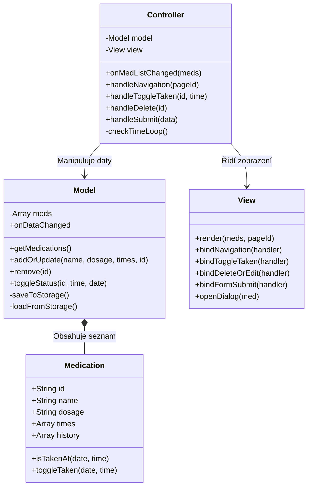

# Medsy

## 1. Funkční specifikace
### 1.1 Charakteristika funkčností
Aplikace slouží jako osobní zdravotní asistent pro evidenci a připomínání léků. Uživatel si může přidat jednotlivé léky, specifikovat u nich dávku a časy, kdy si je vzít. Následně si může zobrazit dnešní léky a označit je za užité. Vždy v čas užití uživateli přijde notifikace. Nakonec si může zobrazit statistiky užívání léků.

**Use Case Diagram:**

```planuml
    @startuml
left to right direction
skinparam packageStyle rectangle

actor "Uživatel (Vlastník)" as User

package "Medsy" {
    
    ' Sekce: Správa léků
    usecase "Přidat nový lék" as UC1
    usecase "Upravit lék a časy" as UC2
    usecase "Smazat lék" as UC3
    usecase "Zobrazit seznam léků" as UC4

    ' Sekce: Denní agenda
    usecase "Zobrazit denní plán" as UC5
    usecase "Potvrdit užití (Check-in)" as UC6
    usecase "Zrušit užití (Undo)" as UC7
    usecase "Sledovat denní postup (%)" as UC8

    ' Sekce: Statistiky
    usecase "Zobrazit historii (Kalendář)" as UC9
    usecase "Zobrazit celkové statistiky" as UC10

    ' Systémové funkce
    usecase "Povolit notifikace" as UC11
}

' Vazby od uživatele
User --> UC1
User --> UC2
User --> UC3
User --> UC4

User --> UC5
User --> UC6
User --> UC7
User --> UC8

User --> UC9
User --> UC10
User --> UC11

' Vnitřní vazby (extends)
UC6 .> UC5 : <<extends>>
UC7 .> UC5 : <<extends>>
UC2 .> UC4 : <<extends>>
UC3 .> UC4 : <<extends>>

@enduml
```

www.plantuml.com/plantuml/png/TPB1Rjf048Rl-nGZf2haa2e14f8eGf7IMrMf4YA7tYRs02klTwtTiLLJzH7w01mvSgZw1Et5zNjrRUpKfeK3ukV_vf-PtGN_UNICbjDO2KLB1ZPWvMhD44fB0KkZXOkaJj1Y30a64QvephaYg6pKAqL2OC36mc1H_f8PCYaOFYjqh8llqVa0qC72aHMYAOV11mfTFe0leXgW_Zg3EKK1tSCyiSKkGr35FYf_r5xgA43dopwMMnaYWpPPyRCc3k5FLtrkaLZC9DS48Fp-XYvlo56VdCUuGUv6ZVl09_DYSUEp76qqnirO3JiH_TdVaVOh0wv8XtWY9pmmYIfskecvFjhIS6P3ZwR-EDcpmwSr1T65rETDmSrHjatBNPTVwD2qxFHeOKMXoV3l7CPnci3mJSlVYgFxO6JfM4RvYONMtZLMIXY-H-KNBtRbjWsxEr4Ja8fCLkp1lQQtDtdvsZztNEpZ6bkcEWhe-9WoesJr65WkPOG1jH5NugiGP_2CcvSSJ0Xf-on9LEyGBYvc5TOLewuOTyL4TDLrLznqnRGhRdj5TxssbprrLK-g9PVRwZgoUkOXVMRIeJiNlWcyhHl3FJmyDF_FPjwOdZ961sFoZp7-lo4U_OyqLdy0
### 1.2 Specifikace uživatelských rolí a oprávnění

Vzhledem k architektuře aplikace (Client-Side Only) existuje pouze jedna role.

- **Role: Vlastník zařízení (Lokální Uživatel)**
    - **Přístup:** Aplikace je přístupná okamžitě po načtení stránky, nevyžaduje přihlášení.
    - **Oprávnění:**
        - Plný přístup ke čtení i zápisu dat (CRUD).
        - Správa nastavení prohlížeče (povolení notifikací).
        - Data jsou vázána na konkrétní prohlížeč a zařízení (localStorage).
### 1.3 Uživatelské grafické rozhraní

Aplikace využívá designový jazyk **Material Design 3**, je rozvržena do layoutu s postranní navigací a hlavním obsahem.
#### A. Hlavní navigace
- Panel vlevo obsahující logo aplikace nahoře.
- Tři navigační tlačítka pro přepínání sekcí: **Dnes**, **Moje léky**, **Statistiky**.
- Aktivní sekce je vizuálně zvýrazněna.
#### B. Sekce 1: Dnes - Výchozí obrazovka
- **Hlavička:** Zobrazuje aktuální datum a tlačítko "Zapnout upozornění" (pokud nejsou povolena).
- **Progress Card:** Velká karta s grafickým indikátorem zobrazujícím % splněných dávek pro dnešní den.
- **Grid karet (Mřížka):** Seznam karet. Každá karta reprezentuje **jednu konkrétní dávku** v konkrétní čas.
    - Stav Nesplněno: Karta je bílá, tlačítko "Užít".
    - Stav Splněno: Karta zezelená, text se přeškrtne, tlačítko se změní na "Splněno" (s možností vrácení).
- **Empty State:** Pokud není nic naplánováno, zobrazí se ikona s textem "Všechny léky užity".
#### C. Sekce 2: Moje léky
- **Hlavička:** Tlačítko "+ Nový lék", které otevírá modální okno.
	- **Modální okno (Dialog)**
		- Formulář pro přidání/editaci léku.
		- Dynamické pole pro časy: Uživatel může tlačítkem "+ Čas" přidávat libovolný počet časů, kdy lék užít.
- **Tabulka léků:** Seznam s řádky obsahujícími: Název, Dávku, Časy užívání (seznam oddělený čárkou).
- **Akce:** Na konci každého řádku jsou ikony pro **Editaci** (tužka) a **Smazání** (koš).
#### D. Sekce 3: Statistiky
- **Přehled čísel:** Karta s celkovým počtem užitých dávek.
- **Kalendář:** Mřížka generovaná JavaScriptem pro dny aktuálního měsíce.
    - Algoritmus prochází historii a pro každý den vypočítá poměr _plánované vs. splněné_.
    - Buňky dne jsou podbarveny dle stavu - nesplnění, splněno částečně, splněno.

## 2. Technická specifikace
### 2.1 Datový logický model

Data jsou ukládána v **Local Storage** prohlížeče pod klíčem `medsy_db`. Formát dat je JSON pole objektů.

**Struktura JSON objektu:**
`[`
  `{`
    `"id": "uuid-string-12345",     // Unikátní identifikátor`
    `"name": "Ibalgin",             // Název léku`
    `"dosage": "400mg",             // Dávkování`
    `"times": ["08:00", "20:00"],   // Pole časů užívání`
    `"history": [                   // Historie splnění`
      `"2023-12-01|08:00",          // Kompozitní záznam: Datum|Čas`
      `"2023-12-01|20:00"`
    `]`
  `}`
`]`
### 2.2 Popis architektury

Aplikace je navržena podle návrhového vzoru **MVC (Model-View-Controller)**.
1. **Model (`js/Model.js`):** Zodpovídá za data a logiku. Komunikuje s `localStorage`. Obsahuje Observer pattern (`onDataChanged`) pro notifikaci změn.
2. **View (`js/View.js`):** Zodpovídá za manipulaci s DOM. Generuje HTML a zachytává uživatelské vstupy (kliknutí, formuláře), které předává Controlleru.
3. **Controller (`js/Controller.js`):** Spojuje Model a View. Inicializuje aplikaci, obsahuje smyčku pro kontrolu času (notifikace) a řídí tok dat.
#### Třída Medication
- Atributy: `id`, `name`, `dosage`, `times`, `history`.
- Metody:
    - `isTakenAt(date, time)`: Vrací `true`/`false`, zda je lék v daný termín užit.  
    - `toggleTaken(date, time)`: Přidá nebo odebere záznam z historie.  
#### Třída Model
- Atributy: `#meds` (pole instancí Medication).
- Metody:
    - `getMedications()`: Vrací všechna data.    
    - `addOrUpdate(name, dosage, times, id)`: Přidá nový lék nebo aktualizuje existující (se zachováním historie).    
    - `remove(id)`: Smaže lék.    
    - `toggleStatus(id, time, date)`: Změní stav užití konkrétní dávky.    
    - `#saveToStorage()`, `#loadFromStorage()`: Práce s JSON v localStorage.
#### Třída View
- Atributy: Reference na DOM elementy (`todayGrid`, `dialog`, `form`...).
- Metody (Render):
    - `render(meds, pageId)`: Hlavní metoda pro překreslení.    
    - `#renderToday(meds)`: Generuje karty pro denní přehled.    
    - `#renderStats(meds)`: Generuje kalendář a logiku barev.    
- Metody (Bind): `bindNavigation`, `bindToggleTaken`, `bindDeleteOrEdit`, `bindFormSubmit`.
- Metody (UI): `openDialog(med)`, `#addTimeInput()`.    
#### Třída Controller
- Metody:
    - `constructor(model, view)`: Inicializace a binding.    
    - `handleToggleTaken(id, time)`: Callback pro View.    
    - `#checkTimeLoop()`: Běží každých 30s, kontroluje shodu aktuálního času s časy léků pro notifikace.
#### Class diagram

https://www.mermaidchart.com/d/8d5a0748-0249-4b7a-ac43-e3608e3448c4

### 2.4 Použité technologie

- **HTML5:**
- **CSS3:**
    - **Material Design 3:** Vizuální styl.
- **JavaScript (ES6):**    
    - **LocalStorage API:** Trvalé uložení dat u klienta.    
    - **Notification API:** Systémová upozornění. 